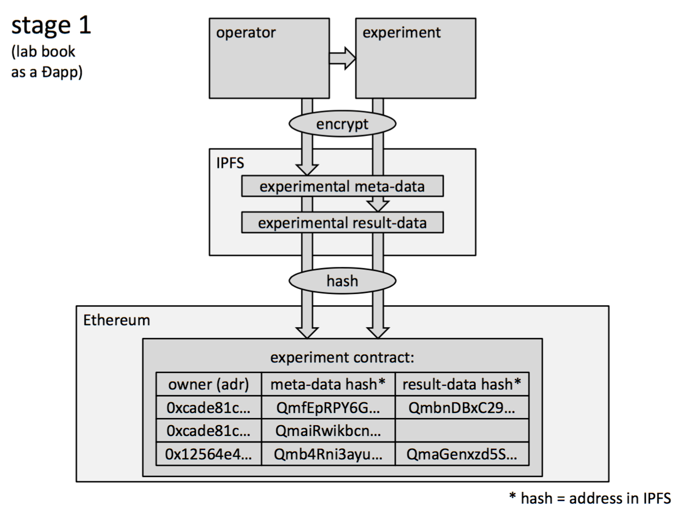
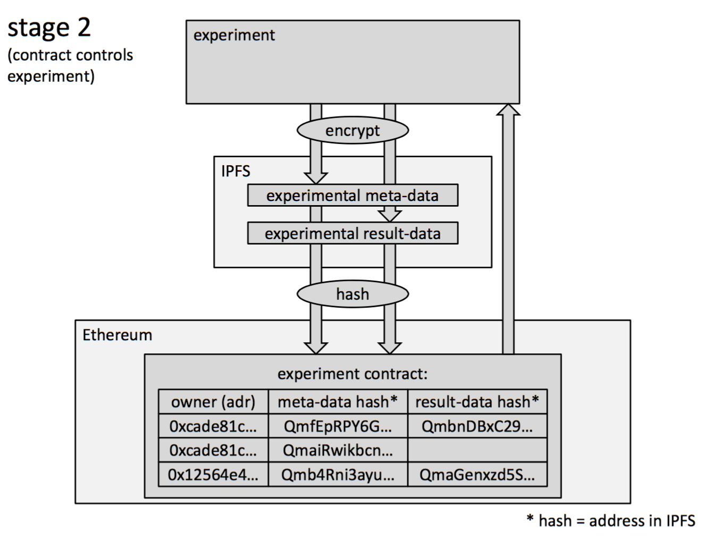

# Đexperiments
A code repository for a Decentralized Lab Book

S. C. Bürgel (s.buergel@gmail.com

## documentation of academic experiments
* hand‐written in lab book
* required by law
* should not be falsifiable
* should provide meta‐data to reconstruct data
* inconsistently executed
* always messy

 

## aims

### make the documentation of experimental data:

* more transparent
* easier available
* ready for the next level of “smart‐science”

by implementing:
* (encrypted) meta‐data stored on IPFS
* (encrypted) experimental result‐data stored on IPFS
* hash of lab book entries published on blockchain

